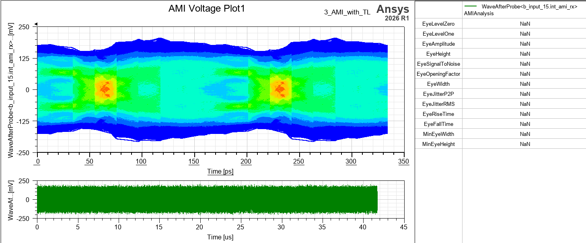

# IBIS-AMI 眼圖自動化最佳化工具 — 操作說明 (SOP)

---

## ⚔️ 傳統調校 vs. 現代最佳化

| 特性 | 傳統參數掃描 (Parametric Sweep) | 本工具 (optiSLang 自動化) |
| :--- | :--- | :--- |
| **效率** | 低 (線性搜尋，模擬次數隨變數暴增) | **極高 (AI 智慧取樣，大幅減少模擬次數)** |
| **準確度** | 靠經驗試錯 (容易陷入局部陷阱) | **數據驅動 (自動定位全球最佳解)** |
| **維度限制** | 難以處理 3 個以上的變數交互作用 | **輕鬆處理多維度 (如 10+ 段線寬/間距)** |
| **洞察力** | 僅能看趨勢圖 | **提供敏感度分析 (一眼看出關鍵參數)** |
| **目標設定** | 難以將眼高/眼寬設為直接目標 | **精準自動抓取數值作為優化目標** |

---

## 🌟 工具核心亮點 (New Features)

### 1. 🤖 核心必要性：突破 Circuit 原生最佳化瓶頸
在 Ansys Circuit 中，AMI 報告的數據（EyeHeight/EyeWidth）通常存在於報表或圖例中，無法直接作為最佳化節點的「目標函數」。
*   **本工具價值**：透過自動化腳本，將眼圖數據從報表中精準提取，並轉換為 optiSLang 可讀取的數值，實現「眼圖品質」的直接尋優。

### 2. 🎯 雙節點全自動工作流
本工具採用 **AMOP (Metamodel of Optimal Prognosis)** 與 **Optimization** 雙節點架構：
*   **智慧初始範圍推斷**：根據當前設計自動計算 ±1 取樣空間，提供更科學的初始尋優區間。
*   **名稱匹配同步技術**：解決傳統索引對位問題，改採名稱匹配確保 optiSLang 與 AEDT 變數 100% 同步。

### 3. 🧹 異常監控與 AI 模型淨化
*   **無效模擬自動過濾**：系統會即時監控模擬狀態，若偵測到眼圖閉合或數據異常，會自動標記並剔除該錯誤樣本。
*   **確保訓練準確度**：這項技術能防止「垃圾數據」污染 AI 預測模型 (MOP)，確保最佳化演算法只根據高品質的有效數據進行訓練。

---

## 🛠️ 常見參數化優化對象 (What to Optimize?)

本工具可處理所有在 AEDT 中定義為變數 (Variables) 的參數，常見的高速訊號優化對象包括：

*   **傳輸線幾何 (Transmission Line)**：
    *   **線寬 (Width)** 與 **間距 (Spacing)**：控制阻抗匹配 (Impedance Matching)。
    *   **長度 (Length)**：調整相位對位 (Phase Alignment)。
*   **過孔設計 (Via Design)**：
    *   **焊盤/防焊盤大小 (Pad/Antipad Size)**：減少反射損耗。
    *   **殘樁長度 (Stub Length)**：消除共振效應。
*   **主機端等化器 (IBIS-AMI EQ)**：
    *   **CTLE (Continuous Time Linear Equalizer)**：直流增益與頻譜補償。
    *   **DFE (Decision Feedback Equalizer)**：多階 Tap 係數自動尋優。
    *   **Pre-emphasis/De-emphasis**：預加重設定。

---

## 🧠 optiSLang 核心觀念與判讀指南 (Technical Insights)

為了讓您不僅能「操作」工具，更能「解讀」結果，以下為 Ansys 官方文獻中幾個關鍵理論的白話文解析，這將幫助您在日後的高速訊號優化中做出更精確的工程決策：

### 1. 取樣空間設計 (Design Space) 與拉丁超立方抽樣法
*   **概念**：當我們設定了 ±1 的搜尋範圍，這就定義了我們的「取樣空間」(Design Space)。
*   **拉丁超立方 (Latin Hypercube)**：optiSLang 採用拉丁超立方抽樣，它確保了在最少的模擬次數內，能極度均勻地探測整個多維參數空間，不會像傳統 Monte Carlo 容易產生樣本群聚或空洞，這是建立高精度預測模型的重要基礎。
*   **取樣次數建議 (Rule of Thumb)**：
    *   **基礎公式**：源自 Ansys/Dynardo 官方技術手冊建議，初始取樣數至少為 10 * N (N 為變數個數)。
    *   **實務建議**：針對 10 個變數的眼圖優化，設定 **100 ~ 200 次** 即可獲得具參考價值的模型；若追求更高精度的全球最佳解，可設定至 **500 次**。相較於傳統掃描的數萬次，這依然是極高效率的選擇。

### 2. 敏感度分析 (Sensitivity Analysis) 
*   **概念**：找出哪些變數是「主因」，哪些是「雜訊」。
*   **實務價值**：在高速訊號中，如果我們將 10 段線寬都設為變數，敏感度圖表 (Sensitivity Plot) 會直接告訴您「只有靠近接頭的那 2 段線寬」對眼高 (EyeHeight) 有決定性影響。這能幫助您在後續設計中，將注意力與公差控制 (Tolerance) 集中在這些關鍵參數上。

### 3. CoP (Coefficient of Prognosis) 預測係數
*   **概念**：評估 AI 預測模型準確度的終極指標。
*   **與傳統 R² (決定係數) 的區別**：
    *   **傳統 R²**：衡量的是模型對「既有數據」的擬合程度。R² 越高代表模型越貼近已跑過的模擬點，但缺點是容易產生「過度擬合」(Overfitting)——即模型只是死背答案，遇到新的參數組合時預測就會失準。
    *   **CoP**：使用了交叉驗證 (Cross-Validation) 技術。它會不斷地「藏起一部分數據」，用剩下的數據建模後再去預測被藏起來的點。因此，CoP 衡量的是模型對「未知數據」的預測能力，在工程最佳化中比 R² 具備更高的參考價值。
*   **如何判讀**：
    *   **CoP > 90%**：模型極度完美，其預測結果與實際跑 3D 模擬幾乎無異。
    *   **CoP 70% ~ 90%**：模型品質良好，足以提供非常精準的最佳化方向。
    *   **CoP < 40%**：表示變數與結果之間幾乎沒有關聯（或有極大的雜訊/網格誤差）。此時不應盲目進行最佳化，應回頭檢查電路設定或縮小參數範圍。

### 4. MOP (Metamodel of Optimal Prognosis) 最優預測元模型
*   **概念**：傳統的響應曲面 (RSM) 通常只能使用二次多項式擬合，對於非線性的電磁/電路反應極其無力。MOP 會自動在背後嘗試數十種數學模型（包含多項式、移動最小平方法、Kriging 等），並自動挑選出 **CoP 最高 (最準確)** 的那個模型來代表您的系統。
*   **實務價值**：它就像是一個超級大腦，把耗時的 Circuit/HFSS 模擬轉換成毫秒級的數學方程式，讓 OCO 最佳化演算法能在這個「虛擬模型」上瞬間進行幾萬次搜尋，最後再將找到的最優點送回真實的 AEDT 驗證，這就是本工具能「極速」找到最佳解的秘密。

---

## 📊 實際操作範例 (以 5 段傳輸線為例)

### 1. 案例背景
本案例包含 5 段傳輸線，分別處於 5 種不同的介質與堆疊厚度（如 Substrate_3, Substrate_5880 等）。這類「多段介質阻抗匹配」在傳統設計中極難透過人工經驗優化。本工具的目標是在複雜環境下，自動尋找每一段線路最佳的 W/SP 組合。

### 2. 初始狀態 (優化前)
初始設計因阻抗匹配不良，眼圖品質較差，仍有極大的優化空間。下圖展示了待優化的 5 段傳輸線電路架構與初始參數。

---

### 3. 標準操作流程 (SOP)

為了優化上述電路，請依照以下步驟操作工具：

#### Step 1: 連接與同步 AEDT
> **重要前置作業**：在執行腳本前，請務必先**開啟 Ansys AEDT** 並載入您的專案。

1.  雙擊 `ami_eye_optimizer.py` 啟動 Dashboard。
2.  **版本選擇**：選擇對應的 Ansys 版本 (支援最新 **2026 R1**)。
3.  **掃描連線**：點擊 **「掃描開啟的專案 (Scan)」**，工具將自動偵測並列出當前所有已開啟的 AEDT 實例，請確認抓到正確的 Project、Design 與 Setup。

#### Step 2: 參數配置與雙節點工作流設定
在「2. 參數 & 雙節點設定」分頁中，您可以完成從變數提取到專案建立的完整自動化配置。

#### 💡 此介面的核心優點：
*   **一鍵同步 (Sync)**：自動從 AEDT 提取所有可變動參數，免去手動鍵入變數名稱與數值的風險。
*   **精確控管 (Control)**：
    *   **Optimize 勾選**：靈活決定哪些變數要參與 AI 優化，哪些維持固定。
    *   **Type 判定 (REAL vs INT)**：系統會自動初步識別，但請務必檢查：
        *   **REAL (連續型)**：適用於可細分的物理量，如**線寬 (W)、間距 (SP)**、電壓等。
        *   **INT (整數型)**：適用於必須為整數的設定，如 **FFE/DFE 的 Tap 權重、等化器階數**或選單索引。
*   **一鍵專案生成**：自動產生 optiSLang 專案 (.opf) 與底層連動腳本，省去手動建立 Sensitivity 與 Optimization 節點的繁瑣步驟。

#### 🚀 「儲存後立即開始計算」勾選建議：
這是一個關鍵的自動化控制開關，請根據您的需求決定：

*   **✅ 勾選：實現「全自動一鍵到底」流程**
    *   **適合場景**：專案設定已確認無誤，希望在生成專案後直接讓電腦開始跑模擬。
    *   **結果**：點擊生成按鈕後，optiSLang 會自動啟動並執行所有的取樣與優化搜尋。
*   **❌ 不勾選：保留檢查與進階客製空間**
    *   **適合場景**：需要手動微調 optiSLang 演算法設定、加入特殊的約束條件 (Constraints) 或二次確認節點連線。
    *   **結果**：系統僅會建立檔案，讓您能手動開啟專案進行最後調整後再按下執行。

#### Step 3: 生成與啟動
點擊 **「▶ 生成橋接腳本 + 建立雙節點專案」**。
> **重要**：每次修改參數型別或範圍後，請務必重新生成專案。

---

### 4. AMOP 數值求解過程 (破解維度災難)
系統自動記錄每一組變數對應的眼圖數值。在本範例中，我們同時優化 **10 個參數** (5 段線寬 + 5 段間距)。

*   **為什麼傳統方法做不到？** 若使用傳統參數掃描 (Parametric Sweep)，即便每個參數只取 3 個點，10 個參數就會產生 $3^{10} = 59,049$ 組組合。以一組模擬 30 秒計算，仍需耗時約 **20 天** 才能跑完，這在工程實務上完全不可行。
*   **optiSLang 的優勢**：根據官方建議的 10*N 準則，僅需執行約 **100 次** 智慧抽樣模擬，即可精準掌握這 10 個參數之間的關鍵交互作用，將數週的工期縮短至 **50 分鐘內** 完成。

### 5. AMOP 3D 響應曲面與 AI 預測模型
系統自動建立 3D 響應曲面並定位最佳解 (Design 147)。

#### 📊 數據解讀 (如何讀懂結果圖)：
透過 optiSLang 的 MOP 監控介面，我們可以獲得以下關鍵洞察：

*   **3D 響應曲面 (Response Surface)**：左側大圖展示了 W1 與 W5 對眼寬 (EyeWidth) 的交互影響。橘紅色頂峰區域代表「最佳設計區」，系統會自動在該區域標記出 **Design 147** 為目前發現的最佳解點。
*   **總體分析 (Total Effect)**：右下角的長條圖顯示了各個參數對結果的「貢獻度」。
    *   在本例中，**W1 (30.9%)** 與 **W5 (24.9%)** 是影響品質的最主導因素。
    *   **SP3 (5.4%)** 的影響權重極低，這意味著該參數在目前範圍內對眼圖影響不大，未來設計時可考慮放寬其公差以降低生產難度。
*   **預測模型準確度 (Residual Plot)**：右上角的散點圖展示了「AI 預測值」與「真實模擬值」的對位關係。所有的點都緊密分布在對角線附近，代表 MOP 模型能精準預測未知的參數組合。
*   **預測品質 CoP (達 68.9%)**：這代表 AI 模型能解釋約 69% 的物理變化。在 10 個變數的高維度複雜系統中，此數值雖非完美但**尚屬堪用且具參考價值**，足以引導後續的最佳化搜尋方向。

### 6. OCO 最佳化搜尋過程
在 AMOP 模型建立後，系統會啟動 OCO (Optimization) 節點進行精確搜尋，透過多次迭代確保鎖定全球最佳解。每一行代表一次精確的參數探索。

### 7. 優化結果對照 (Before vs. After)

#### 📈 效能提升對比表
| 項目 | 初始狀態 (Initial) | 優化後結果 (Optimized) | 改善幅度 |
| :--- | :--- | :--- | :--- |
| **眼高 (EyeHeight)** | **35.5 mV** | **~105 mV** | **~195%** |
| **眼寬 (EyeWidth)** | **101 ps** | **~103 ps** | **穩定提升** |

### 8. 差勁設計對照 (Closed Eye)
系統會自動識別並跳過此類設計。

---

## 🏁 結論 (Conclusion)

本工具成功打破了 Ansys Circuit 在 IBIS-AMI 模擬中的原生限制，將繁瑣的「手動嘗試」轉化為「智慧搜尋」。透過 **AI 驅動的響應曲面技術 (MOP)** 與 **自動化橋接腳本**，工程師不再需要枯坐在電腦前進行無意義的參數掃描，而是能專注於更具價值的模擬決策與架構分析。

這不僅僅是一套腳本，更是一套**完整的數據驅動設計流程**：
1. **自動化提取**：解決眼圖數據無法直接參與最佳化的痛點。
2. **高品質數據**：透過異常值過濾確保 AI 模型的純淨度。
3. **視覺化洞察**：透過 3D 響應曲面與敏感度分析，看透參數間的深度交互。

在追求高速訊號品質的競賽中，本工具將協助您在更短的時間內，以更科學的方式達成設計目標。

---

## ❓ FAQ 常見問題

**Q: 我需要手動修改 aedt_bridge.py 嗎？**
**A**: 不需要。Dashboard 已內建強大的橋接腳本模板生成器，會自動根據您的設定產生必要的程式碼。

**Q: 工具是否支援不同版本的 Ansys AEDT？**
**A**: 是的，本工具具備跨版本相容性（例如支援 2025 R1 至 2026 R1 等）。您只需在介面的版本選單中選擇對應的 AEDT 版本，工具即可自動完成環境配置與連線。

**Q: 如何解決 OptiSLang 連線失敗或找不到執行檔的問題？**
**A**: 系統已內建自動路徑偵測機制，能智慧尋找不同版本 optiSLang 的安裝位置。若仍遇到連線錯誤，請確認 Ansys 軟體是否安裝於系統預設路徑，或手動確認系統環境變數設定。

**Q: 電腦如果沒有安裝 Python 環境也可以執行嗎？**
**A**: 可以的。本工具已封裝為獨立的免安裝執行檔 (Portable Executable)，無論電腦有無 Python 環境或是否有系統管理員權限，皆可直接點擊執行。

**Q: 執行自動化抓取或設定時，程式介面會不會卡死？**
**A**: 不會。系統底層採用了背景工作執行緒 (Background Worker Thread) 處理與 AEDT 之間的 pythonnet 溝通，能有效防止主介面卡死，並解決潛在的 CLR 崩潰問題。

---

此工具由虎門科技資深技術工程師 Jeff Hong 洪敬傑 提供

